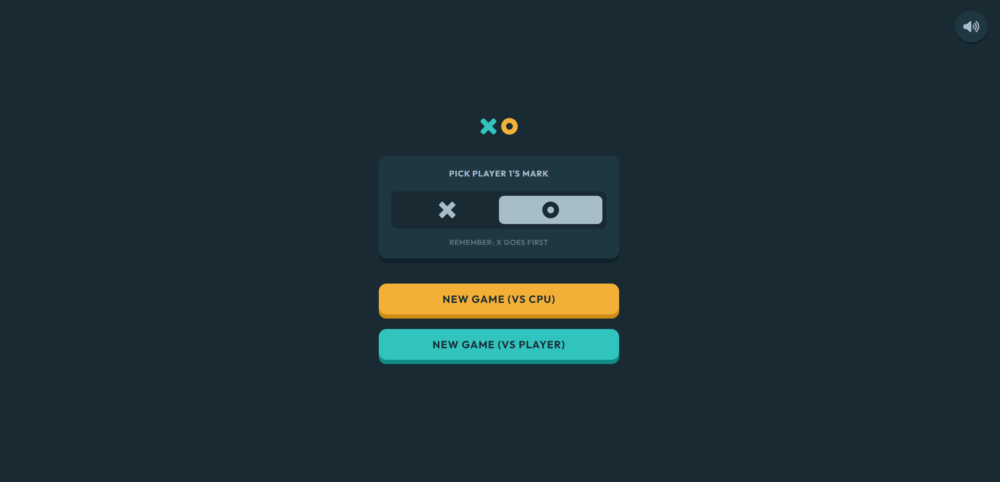
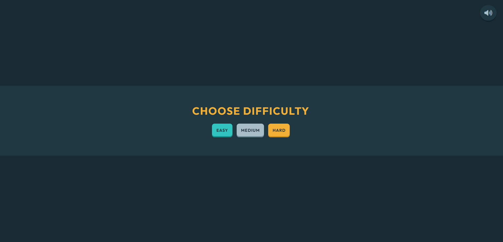
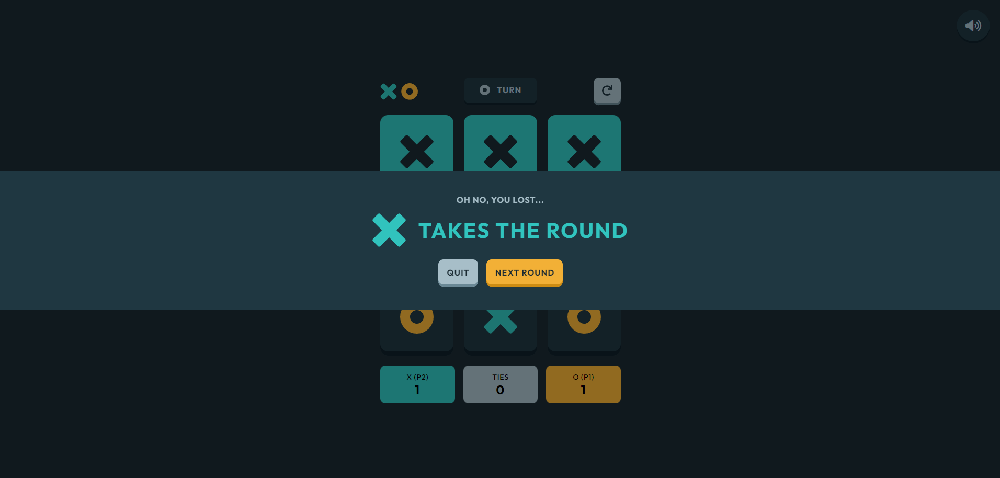
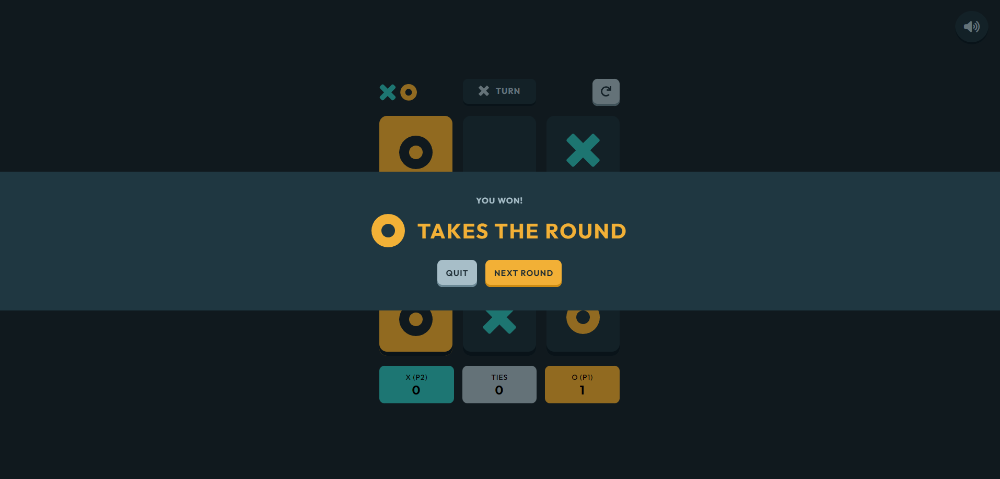
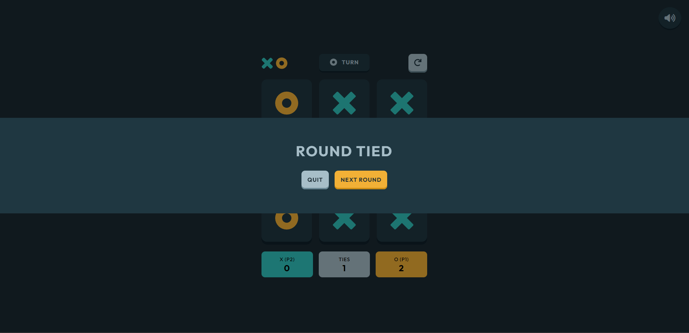

# Frontend Mentor - Tic Tac Toe solution

This is a solution to the [Tic Tac Toe challenge on Frontend Mentor](https://www.frontendmentor.io/challenges/tic-tac-toe-game-Re7ZF_E2v). Frontend Mentor challenges help you improve your coding skills by building realistic projects. 

## Table of contents

- [Overview](#overview)
  - [The challenge](#the-challenge)
  - [Screenshot](#screenshot)
  - [Links](#links)
- [My process](#my-process)
  - [Built with](#built-with)
  - [What I learned](#what-i-learned)
  - [Continued development](#continued-development)
  - [Useful resources](#useful-resources)
- [Author](#author)

## Overview

### The challenge

Users should be able to:

- View the optimal layout for the game depending on their device's screen size
- See hover states for all interactive elements on the page
- Play the game either solo vs the computer or multiplayer against another person
- **Bonus 2**: Instead of having the computer randomly make their moves, try making it clever so it’s proactive in blocking your moves and trying to win

### Expected behaviour

- You can choose to make the default screen either the new game menu or the solo player game board i.e. play with cpu. 
  - If you choose the solo player game mode, you get to choose a difficulty level - easy, medium and hard
- On the new game screen, whichever mark isn't selected for the first player is automatically assigned to the second player when the game is started.
- The first turn of the first round is always played by whoever is playing as X. For every following round, the first turn alternates between O and X.
- After a round, if the player chooses to quit the game, they should be taken back to the new game menu.
- If the restart icon in the top right is clicked, the "Restart game?" modal should show and allow the player to reset the game or cancel and continue to play.

### Screenshot

- Main: 
- Play w CPU: 
- Lost round: 
- Win round: 
- Tied round: 

### Links

- Solution URL: [Add solution URL here](https://your-solution-url.com)
- Live Site URL: [Add live site URL here](https://your-live-site-url.com)

## My process

### Built with

- Semantic HTML5 markup
- CSS custom properties
- Flexbox
- CSS Grid
- Mobile-first workflow
- [Styled Components](https://styled-components.com/) - For styles

### What I learned

insertBefore()

### Continued development

To continue with **Bonus 1**: Save the game state in the browser so that it’s preserved if the player refreshes their browser

### Useful resources

- [https://tunetank.com/?themes=27&moods=4](https://tunetank.com/?themes=27&moods=4)
- [Animista](https://animista.net/play/entrances/bounce-in/bounce-in-left) - A website for simple animations

## Author

- Frontend Mentor - [@Jo-cloud85](https://www.frontendmentor.io/profile/Jo-cloud85)
